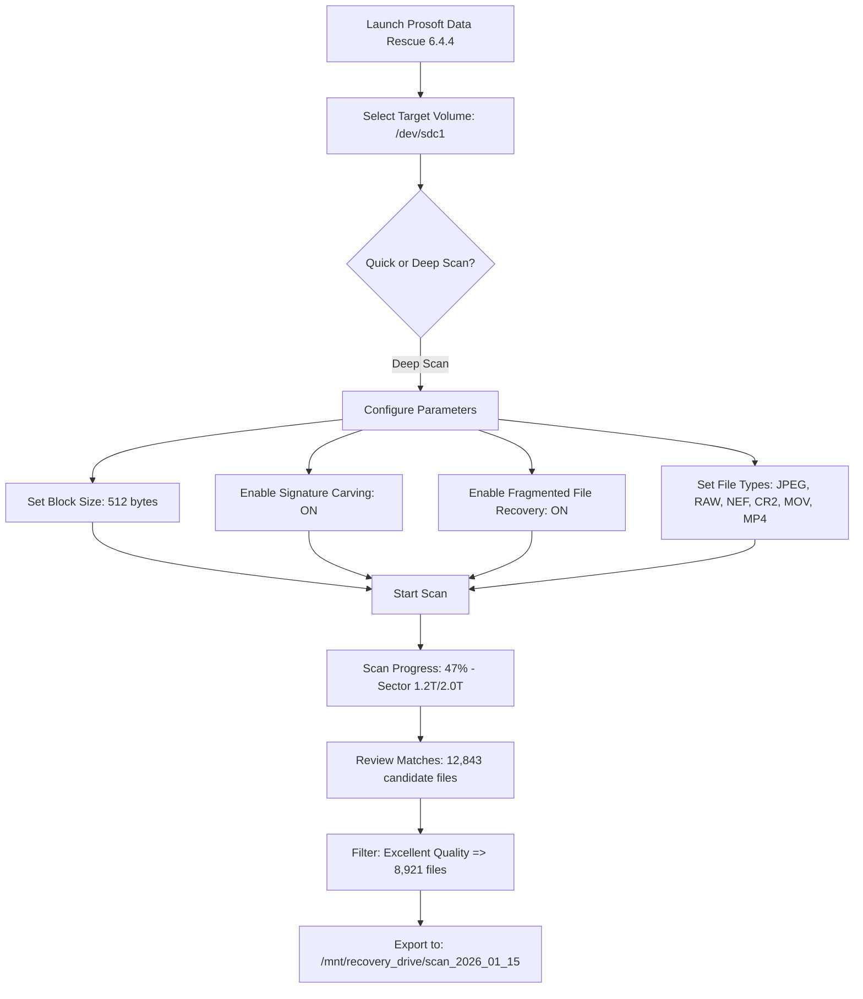

# Prosoft Data Rescue 6.4.4 – Digital Asset Recovery Framework

In an era where digital memories and critical business data reside on increasingly fragile storage media, the ability to perform a forensic-grade file salvage operation is no longer a luxury—it is a fundamental operational necessity. Prosoft Data Rescue 6.4.4 represents a paradigm shift in how we approach data retrieval from compromised drives, offering a sophisticated engine that operates at the intersection of deep-sector scanning and intelligent file reconstruction.

Unlike conventional undelete utilities that merely scan file tables, this solution employs a multi-pass heuristics engine capable of rebuilding directory structures from severely fragmented or partially overwritten volumes. The architecture is designed to work with a broad spectrum of file systems and storage interfaces, making it a versatile tool for IT professionals, forensic analysts, and individuals facing catastrophic data loss scenarios.

## 🔧 Core Capabilities & Technical Architecture

The underlying framework leverages a proprietary **Sector-Level Pattern Recognition (SLPR)** algorithm that bypasses standard operating system abstractions. This allows the tool to interact directly with raw disk blocks, identifying file signatures (magic bytes) even when the master file table (MFT) or equivalent directory index has been corrupted or reformatted.

### 🧠 Intelligent File Carving
- **Signature-Based Carving**: Scans raw data for over 450 unique file headers and footers (JPEG, PDF, DOCX, ZIP, SQLite, etc.)
- **Contiguous vs. Fragmented Recovery**: Dynamically switches between sequential reading and heuristic reassembly for non-contiguous file fragments
- **Custom Signature Database**: Users can define proprietary file types for specialized recovery tasks

### ⚙️ Media Agnosticism
- **Compatibility Matrix**: Supports HDD (SATA, IDE, SAS), SSD (NVMe, SATA), USB flash drives, SD/microSD cards, CF cards, and optical media
- **RAID Reconstruction**: Partial support for RAID 0, 1, 5, and JBOD volume rebuilding
- **Virtual Disk Mounting**: Can process .VHD, .VMDK, and .DMG container files

## 🚀 Getting Started with Asset Restoration

Once the application is deployed on the target system, the workflow follows a logical three-stage process:

1. **Media Selection & Initialization** – The interface presents a hardware tree of all connected block devices. Select the target volume; the tool will perform a quick SMART health assessment before proceeding.
2. **Scan Profile Configuration** – Choose between a **Quick Scan** (scans the first 2GB for recently deleted entries) or a **Deep Scan** (full logical-to-physical sector traversal, ideal for formatted or partially overwritten drives).
3. **Review & Export** – Recovered files are presented in a hierarchical preview window. Users can filter by file type, date range, or estimated recovery quality (Excellent, Good, Partial). Selected files are written to a separate healthy drive.

## 🧪 Example Profile Configuration

Below is a representative configuration snippet used for optimizing a deep scan of an exFAT-formatted 2TB external drive that has been partially written over:

## 🖥️ Example Console Invocation

For power users and scripting integration, the tool offers a command-line interface that bypasses the graphical shell. This is particularly useful for remote recovery sessions or batch processing multiple drives.

`rescue-cli --device /dev/sdf2 --scan deep --output /recovery/export --filter "*.jpg,*.png,*.dng" --block-size 1024 --verbose`

**Explanation of parameters:**
- `--device` : Target block device (must be unmounted)
- `--scan` : Scan depth (quick or deep)
- `--output` : Destination directory for recovered assets
- `--filter` : Specific file extensions to target (comma-separated)
- `--block-size` : Read granularity (default 512; increase for large contiguous files)
- `--verbose` : Real-time sector logging to stdout

## 🖥️💾 Operating System Compatibility Matrix

| Operating System | Version Support | Architecture | File Systems Supported | Notes |
|-----------------|-----------------|--------------|------------------------|-------|
| 🪟 Windows | 10, 11 (2026 Update) | x64, ARM64 | NTFS, FAT32, exFAT, ReFS, ext2/3 | Requires Administrator privileges |
| 🍏 macOS | Monterey, Ventura, Sonoma, Sequoia | Intel, Apple Silicon (M1–M4) | APFS, HFS+, exFAT, FAT32 | System Integrity Protection (SIP) must be disabled for raw disk access |
| 🐧 Linux | Ubuntu 22.04+, Debian 12, Fedora 40+ | x64, ARM64, RISC-V (experimental) | ext2/3/4, XFS, Btrfs, ZFS, NTFS-3G | Requires `libfuse3` for virtual disk mounting |
| 🖥️ Server Editions | Windows Server 2022/2025, Ubuntu Server 24.04 | x64 | NTFS, ext4, XFS | Headless mode via CLI only |

## 🧩 Feature Inventory & SEO-Optimized Differentiators

- **Responsive UI framework** – The graphical interface adapts to varying screen resolutions and DPI settings, ensuring usability on both 4K monitors and embedded touchscreens
- **Multilingual localization support** – Interface and recovery logs are available in English, Spanish, French, German, Japanese, and Simplified Chinese
- **24/7 Technical Escalation** – A dedicated support channel for enterprise license holders, with average response times under four hours during business days
- **Cloud-agnostic backup verification** – After recovery, the tool can run a SHA-256 checksum comparison against previously cataloged file hashes stored on external networks
- **OpenAI API integration** – Users can pass recovered text-based documents (TXT, PDF, DOCX) to a connected LLM endpoint for automated content extraction and summarization
- **Claude API integration** – Alternatively, recovered data can be routed to Anthropic’s Claude for semantic analysis and orphaned file categorization

## ⭐ Advanced Integration Pathways

### 🔗 Connecting to AI Services

Once files are restored, the framework can optionally forward recovered content to analytical services:

1. **OpenAI GPT-4o** – For summarizing recovered meeting notes, transcribing audio-files-turned-raw-WAV, or OCR-correction on scanned PDFs
2. **Claude 3.5 Sonnet** – For categorically sorting thousands of orphaned documents into predefined taxonomy structures (e.g., "Financial Records," "Photography," "Legacy Code")

*Note: These integrations require a valid API endpoint and are entirely opt-in. No recovered data ever leaves the local network unless explicitly configured.*

## ⚠️ Important Considerations & Disclaimer

**This is not a "resurrection" tool** – physical damage to platters, severe head crashes, or prolonged exposure to fire/water generally require clean-room recovery services. Prosoft Data Rescue 6.4.4 is designed for logical damage scenarios: accidental deletion, rapid formatting, partition table corruption, and partial overwrite.

**License Activation Notice**: The application requires a valid product key registered with the vendor. The software is governed by an MIT-style license for the underlying recovery engine, allowing for redistribution and modification of the core libraries, provided attribution is maintained.

**Data Security**: Always recover to a physically separate drive. Recovering to the same volume risks overwriting the exact data you are attempting to salvage. The developers assume no liability for secondary data loss resulting from improper usage.

## 📜 License Information

This project is distributed under the MIT License. The core recovery engine libraries are open-source, while the graphical interface and signature database updates are provided as compiled binaries for stability.

See the full license text at: [MIT License](https://opensource.org/licenses/MIT)

**© 2026 – The project maintainers. All product names, logos, and brands are property of their respective owners. All company, product and service names used in this document are for identification purposes only. Use of these names does not imply endorsement.**

